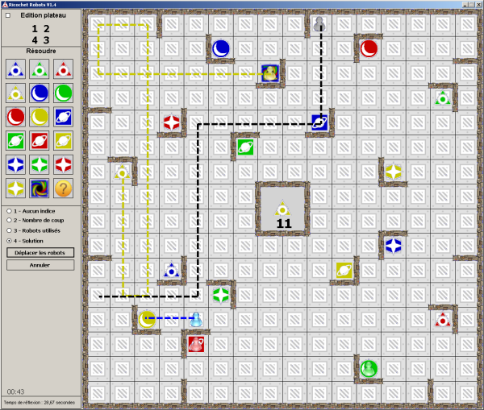

#### Challenge 10 - JavaScript {Robot Ricochet}
===
Votre mission si vous l'acceptez  est de créer un jeu de "Robot Ricochet".

Pour des soucis de performance et de facilité d'implémentation, il est fortement recommandé de se limiter à un plateau de 4x4 cases avec peu de robots présents. 

# Instructions:
+ Trouver un algorithme pouvant aider à résoudre l'exercice (cf. Dijkstra)
+ Définir les tests fonctionnels
+ idéalement vous devrer utilisez grunt  et/ou Sass[facultatif]
+ il vous est conseillé de programmer en orienté objet

##  Règles:
+ Un robot ne peut aller qu'en ligne droite
+ Un robot s'arrête dès qu'il rencontre un mur ou un autre robot.
+ Un minuteur doit être affiché. Un fois le minuteur terminé, la meilleur réponse solution est affichée. 

+ vous pouvez allez plus loin si vous le souhaitez.
 + Pouvoir modifier à son gré la taille du plateau et le nombre de robots
 + Affichage d'indices
 + Animer le robot lorsque la réponse est affichée

Ce projet vous sera utile pour prouver vos compétences au sein de votre portfolio

