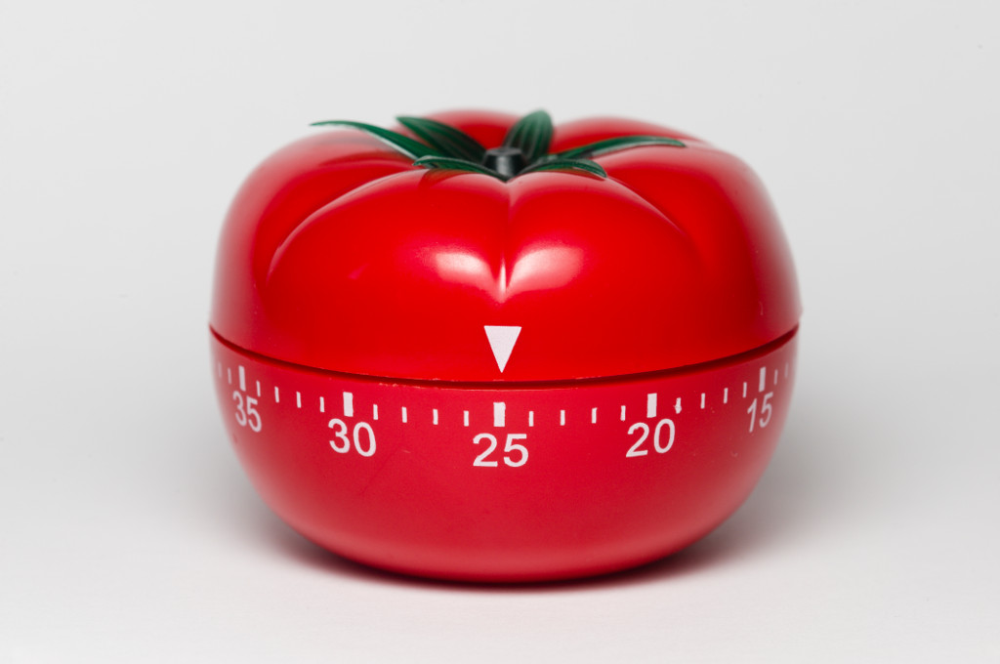

# Pomodoro

Créer une application web pour gérer vos sessions de _Pomodoro_ . Mettez-y du coeur, ce projet apparaitra sans doute sur votre portfolio et partez du principe que vous pouvez l'utiliser.

## Tâches demandés : 

* Affichage du temps en minutes:secondes.
* Le timer dure 20 minutes minimum
* Une fois les minutes de travail dépassées, il change en un timer de repos de 5mn minimum.
* La fin du temps de travail/pause doit être clairement visible via une boîte d'alerte (alert box).
* Bouton pour mettre en pause, lancer, et reset le timer.
* Un minimum de travail graphique est demandé (portfolio oblige). Exemple : [TomatoTimer](https://tomato-timer.com/)

## Bonus :

* Tous les 4 sprints, faîtes une pause plus longue de 15-20mn.
* Proposez à l'utilisateurs de rentrer une liste de tâches qu'il doit faire pendant son sprint de travail. Proposez lui aussi la possibilité de les valider et d'en avoir un historique tant qu'il reste sur la page.
* Assignez la barre espace à la pause/reprise du timer.
* Activez les notifications du navigateur pour prévenir de la fin du timer.
* Faîtes jouer un son d'alarme pour la fin/reprise du sprint.
* Rendez le timer plus visuel qu'un simple écrénage de secondes. Utilisez des horloges, des graphiques en cercle, des jauges etc... Soyez originaux.

Ne commencez pas les bonus si vous n'avez pas terminer les tâches minimums ! 

Ce projet est à faire autant que possible en JQuery, mais vous êtes autoriser à utiliser des fonctions JS. 

Soyez cohérent dans votre code et faîtes en sorte qu'il soit le plus propre possible, améliorer le autant que vous pouvez en repassant plusieurs fois dessus. 

Bon courage (n'hésitez pas à tester la méthode que vous coder ;).
